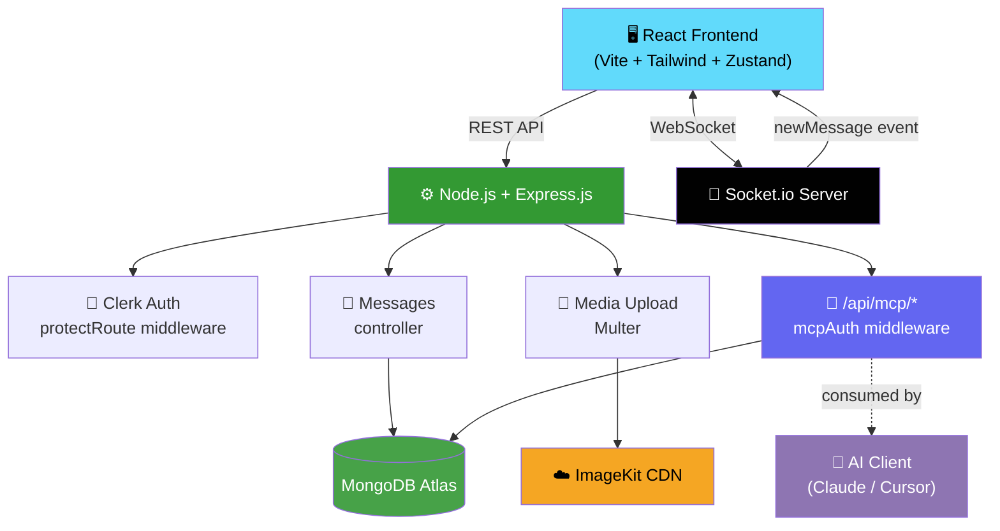
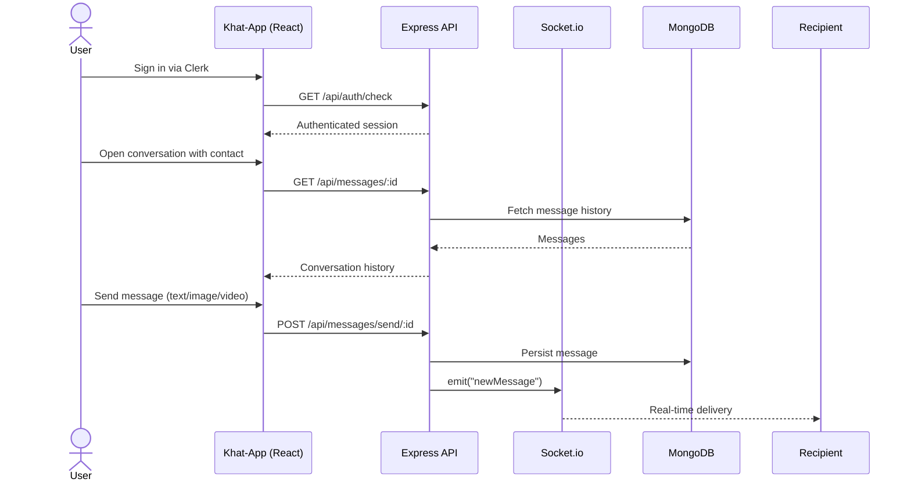
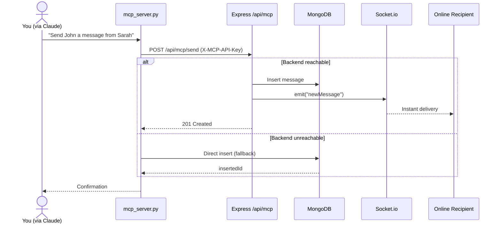

<div align="center">

# 💬 Khat-App

### Full Stack Real-Time Chat Application — with Built-in AI Assistant (MCP) Integration

[](https://react.dev/)
[](https://vitejs.dev/)
[](https://nodejs.org/)
[](https://expressjs.com/)
[](https://www.mongodb.com/)
[](https://socket.io/)
[](https://clerk.com/)
[](https://tailwindcss.com/)
[](https://github.com/jlowin/fastmcp)

[](LICENSE)
[](https://github.com/aryanvisualize/Khat-App/pulls)
[](https://github.com/aryanvisualize/Khat-App/stargazers)
[](https://github.com/aryanvisualize/Khat-App/issues)
[](https://github.com/aryanvisualize/Khat-App/commits/main)

[**Live Demo**](https://khat-app.onrender.com) · [**Report Bug**](https://github.com/aryanvisualize/Khat-App/issues) · [**Request Feature**](https://github.com/aryanvisualize/Khat-App/issues)

</div>

<br>

## 📋 Table of Contents

<details open>
<summary>Click to expand/collapse</summary>

- [Overview](#-overview)
- [Features](#-features)
- [Architecture](#️-architecture)
- [Tech Stack](#️-tech-stack)
- [Application Workflow](#-application-workflow)
- [Project Structure](#-project-structure)
- [Getting Started](#-getting-started)
- [Environment Variables](#️-environment-variables)
- [API Reference](#-api-reference)
- [🤖 MCP Server — AI Assistant Integration](#-mcp-server--ai-assistant-integration)
- [Security](#️-security-considerations)
- [Roadmap](#-roadmap)
- [Contributing](#-contributing)
- [License](#-license)
- [Author](#-author)

</details>

---

## 🌟 Overview

**Khat-App** is a modern, production-ready real-time chat application built on the **MERN stack**. It delivers instant one-to-one messaging with online presence, image/video sharing, and a fully themeable UI — and ships with a built-in **MCP (Model Context Protocol) server**, letting AI assistants like Claude read conversations, search users, and send messages on your behalf, in natural language.

> **One inbox. Real-time everywhere. Now with an AI co-pilot built in.**

---

## ✨ Features

<table>
<tr>
<td width="50%" valign="top">

### 🔐 Secure Authentication
- Clerk-powered sign up / login
- Protected routes via middleware
- Automatic user sync through Clerk webhooks

### 💬 Real-Time Messaging
- One-to-one chat over Socket.io
- Instant delivery, no polling
- Recent conversations sidebar
- Full message history per thread

### 🔍 User Discovery
- Search users by name or email
- Live online presence indicator

</td>
<td width="50%" valign="top">

### 🖼️ Rich Media
- Image & video sharing
- ImageKit CDN uploads via Multer
- 25MB upload limit, type-validated

### 🎨 Personalization
- Light & dark mode
- 11 color themes, 13 chat wallpapers
- Optional keyboard sound effects

### 🤖 AI Assistant Integration
- Built-in FastMCP server
- Query & send messages via Claude / Cursor
- API-key authenticated, DB-fallback resilient

</td>
</tr>
</table>

---

## 🏗️ Architecture



---

## 🛠️ Tech Stack

| Layer | Technologies |
|---|---|
| **Frontend** | React, Vite, Tailwind CSS, HeroUI, Zustand, Axios, Socket.io Client, React Router DOM, Lucide React |
| **Backend** | Node.js, Express.js, Mongoose, Socket.io, Multer |
| **Database** | MongoDB Atlas |
| **Authentication** | Clerk (auth + webhooks for user sync) |
| **Media Storage** | ImageKit CDN |
| **AI Integration** | FastMCP (Python) server, Express `/api/mcp` API, MongoDB fallback |

---

## 🔄 Application Workflow



<details>
<summary><b>🤖 MCP-driven send flow — detail view</b></summary>



</details>

---

## 📂 Project Structure

```text
khat-app/
│
├── frontend/
│   ├── src/
│   ├── public/
│   └── package.json
│
├── backend/
│   ├── src/
│   │   ├── controllers/
│   │   ├── middleware/
│   │   ├── models/
│   │   ├── routes/
│   │   ├── lib/
│   │   ├── seeds/
│   │   └── server.js
│   │
│   └── package.json
│
├── mcp_server.py            # FastMCP server for AI assistants
├── mcp_config.json          # Example Claude Desktop config
├── requirements.txt         # Python deps for the MCP server
├── Dockerfile
└── README.md
```

---

## 🚀 Getting Started

### Prerequisites

- [Node.js](https://nodejs.org/) 22+ & npm
- [Git](https://git-scm.com/)
- A MongoDB Atlas connection string
- A [Clerk](https://clerk.com/) application (publishable + secret key)
- An [ImageKit](https://imagekit.io/) account
- *(Optional)* Python 3.10+ if you want the MCP server

<details>
<summary><b>1️⃣ Clone the repository</b></summary>

```bash
git clone https://github.com/aryanvisualize/Khat-App.git
cd Khat-App
```

</details>

<details>
<summary><b>2️⃣ Install backend dependencies</b></summary>

```bash
cd backend
npm install
```

</details>

<details>
<summary><b>3️⃣ Install frontend dependencies</b></summary>

```bash
cd frontend
npm install
```

</details>

<details>
<summary><b>4️⃣ Configure environment variables</b></summary>

Create `.env` files in both `backend/` and `frontend/` — see [Environment Variables](#️-environment-variables) below.

</details>

<details>
<summary><b>5️⃣ Seed the database</b></summary>

```bash
cd backend
npm run db:seed
```

</details>

<details>
<summary><b>6️⃣ Run the backend</b></summary>

```bash
cd backend
npm run dev
```

</details>

<details>
<summary><b>7️⃣ Run the frontend</b></summary>

```bash
cd frontend
npm run dev
```

The app will be available at the local development URL shown in your terminal.

</details>

<details>
<summary><b>8️⃣ (Optional) Enable the MCP server</b></summary>

```bash
pip install -r requirements.txt
python mcp_server.py
```

See [MCP Server — AI Assistant Integration](#-mcp-server--ai-assistant-integration) for full setup.

</details>

---

## ⚙️ Environment Variables

### Backend (`backend/.env`)

```env
PORT=5001
NODE_ENV=development

MONGO_URI=your_mongodb_connection_string
FRONTEND_URL=http://localhost:5173

CLERK_PUBLISHABLE_KEY=your_clerk_publishable_key
CLERK_SECRET_KEY=your_clerk_secret_key
CLERK_WEBHOOK_SIGNING_SECRET=your_webhook_secret

IMAGEKIT_PUBLIC_KEY=your_imagekit_public_key
IMAGEKIT_PRIVATE_KEY=your_imagekit_private_key
IMAGEKIT_URL_ENDPOINT=your_imagekit_url_endpoint

MCP_API_KEY=your_mcp_api_key
```

### Frontend (`frontend/.env`)

```env
VITE_CLERK_PUBLISHABLE_KEY=your_clerk_publishable_key
VITE_API_URL=http://localhost:5001
```

> ⚠️ **Never commit your `.env` file or API keys to GitHub.**

---

## 🔌 API Reference

<details>
<summary><b>Expand full endpoint list</b></summary>

```text
/api/auth
    GET  /check                 (protected)

/api/messages
    GET  /users                 (protected) — sidebar user list
    GET  /conversations         (protected) — recent conversations
    GET  /:id                   (protected) — message history with a user
    POST /send/:id               (protected) — send message (text/image/video)

/api/mcp                        (X-MCP-API-Key required)
    GET  /users                 — list all users
    GET  /users?q=               — search users
    GET  /conversations         — recent conversations for a user
    GET  /messages               — message history between two users
    POST /send                   — send a message (AI-triggered)
    GET  /online                 — currently online users
```

</details>

---

## 🤖 MCP Server — AI Assistant Integration

<p>
  
  
  
</p>

Khat-App ships with a built-in **[FastMCP](https://github.com/jlowin/fastmcp)** server (`mcp_server.py`) plus a set of authenticated Express endpoints under `/api/mcp`. Together they let any **MCP-compatible AI client** — Claude Desktop, Claude Code, Cursor, or a custom client — read and act on your chat data in natural language.

The server talks to the **live backend API first** (so results reflect real-time state, including Socket.io presence), and transparently **falls back to a direct MongoDB connection** if the backend is unreachable. Every backend call is authenticated with a shared `MCP_API_KEY`, checked with a constant-time comparison to avoid timing attacks.

### Quick Reference

| Tool | Purpose | Key Arguments | Backend Route |
|---|---|---|---|
| `list_users` | List every registered user | — | `GET /api/mcp/users` |
| `search_users` | Find users by name or email | `query` | `GET /api/mcp/users?q=` |
| `get_conversations` | Recent chat partners + last message | `user_email_or_id` | `GET /api/mcp/conversations` |
| `get_messages` | Message history between two users | `user1_identifier`, `user2_identifier`, `limit` | `GET /api/mcp/messages` |
| `send_message` | Send a real-time message | `sender_identifier`, `receiver_identifier`, `text`, `image_url`, `video_url` | `POST /api/mcp/send` |
| `get_online_users` | Users currently connected via Socket.io | — | `GET /api/mcp/online` |

All `*_identifier` arguments accept **any** of: MongoDB `_id`, email address, Clerk ID, or a fuzzy name/email match.

### 🔧 Setup

<details>
<summary><b>1️⃣ Install Python dependencies</b></summary>

```bash
pip install -r requirements.txt
```

Installs `fastmcp`, `pymongo`, `python-socketio`, `requests`, `python-dotenv`, and `pydantic`.

</details>

<details>
<summary><b>2️⃣ Set environment variables</b></summary>

The server reads from a root `.env` or `backend/.env` automatically:

```env
MONGO_URI=your_mongodb_connection_string
BACKEND_URL=http://localhost:3000
MCP_API_KEY=same_key_as_backend_.env
```

> `MCP_API_KEY` must match `backend/.env` exactly — the `mcpAuth` middleware checks it before allowing any `/api/mcp/*` request through.

</details>

<details>
<summary><b>3️⃣ Connect it in Claude Desktop → Connectors</b></summary>

Claude Desktop can pick up `mcp_server.py` directly as a connector:

1. Open Claude Desktop → **+** → **Connectors** → **Add connector**
2. Point it to `mcp_server.py` (or add it via `mcp_config.json` in this repo)
3. Once added, `khat-app` appears in your Connectors list with a toggle — switch it **on**

Alternatively, for other MCP clients (Cursor, custom clients), add it manually:

- **Windows:** `%APPDATA%\Claude\claude_desktop_config.json`
- **macOS:** `~/Library/Application Support/Claude/claude_desktop_config.json`

```json
{
  "mcpServers": {
    "khat-app": {
      "command": "python",
      "args": ["/absolute/path/to/khat-app/mcp_server.py"],
      "env": {
        "MONGO_URI": "your_mongodb_connection_string",
        "BACKEND_URL": "http://localhost:3000",
        "MCP_API_KEY": "your_mcp_api_key"
      }
    }
  }
}
```

Then **fully restart Claude Desktop** so it picks up the new server.

</details>

<details>
<summary><b>4️⃣ Verify the connection</b></summary>

With the `khat-app` connector toggled on, ask Claude:

> "List the tools available from the khat-app MCP server."

You should see all six tools below. If not, run `python mcp_server.py` directly first and check for errors.

</details>

### 🧪 Tool-by-Tool Examples

<details>
<summary><b>📋 <code>list_users()</code></b></summary>

**Prompt:** *"Show me everyone registered on Khat-App."*

```json
{
  "success": true,
  "count": 2,
  "users": [
    { "id": "665f...", "email": "sarah@example.com", "fullName": "Sarah Lee" },
    { "id": "665f...", "email": "john@example.com",  "fullName": "John Doe" }
  ]
}
```

</details>

<details>
<summary><b>🔍 <code>search_users(query)</code></b></summary>

**Prompt:** *"Find any Khat-App users named Sarah."*
**Call:** `search_users(query="sarah")`

</details>

<details>
<summary><b>📩 <code>get_conversations(user_email_or_id)</code></b></summary>

**Prompt:** *"Who has Aryan been chatting with recently?"*
**Call:** `get_conversations(user_email_or_id="aryan@example.com")`

Returns conversation partners sorted by most recent activity, with a last-message preview.

</details>

<details>
<summary><b>💬 <code>get_messages(user1, user2, limit)</code></b></summary>

**Prompt:** *"Show me the last 20 messages between Aryan and Sarah."*
**Call:** `get_messages(user1_identifier="aryan@example.com", user2_identifier="sarah@example.com", limit=20)`

</details>

<details>
<summary><b>✉️ <code>send_message(sender, receiver, text, image_url, video_url)</code></b></summary>

**Prompt:** *"Send John a message from Sarah asking if he's free for a call at 3pm."*
**Call:** `send_message(sender_identifier="sarah@example.com", receiver_identifier="john@example.com", text="Hey John, are you free for a call at 3pm?")`

If John is online, the backend emits a `newMessage` Socket.io event — it appears instantly, no refresh needed.

</details>

<details>
<summary><b>🟢 <code>get_online_users()</code></b></summary>

**Prompt:** *"Who's currently online in Khat-App?"*
**Call:** `get_online_users()`

Requires the backend to be running; returns an empty list rather than erroring if it isn't.

</details>

### 💡 Example Conversations to Try

- *"Check who is online in Khat-App."*
- *"Show me recent messages between Aryan and Sarah."*
- *"Send a real-time chat message to John asking if he's free for a call."*
- *"Search for any users with 'gmail.com' in their email."*
- *"Summarize what Aryan and John have been talking about this week."*

---

## 🛡️ Security Considerations

| Consideration | Implementation |
|---|---|
| Authentication | Clerk-based sessions via `protectRoute` middleware |
| MCP authentication | `X-MCP-API-Key` header, checked with `crypto.timingSafeEqual` |
| Secrets management | Environment variables (`.env`, git-ignored) |
| File uploads | Multer, type-filtered (image/video only), 25MB limit |
| Media storage | Offloaded to ImageKit CDN, not stored on-server |
| Real-time transport | Socket.io scoped to authenticated, connected users |
| MCP fallback | Direct DB access only reachable with a valid `MONGO_URI`, shared solely with trusted local AI clients |

---

## 📌 Roadmap

- [ ] 👥 Group chats & channels
- [ ] ✅ Read receipts & typing indicators
- [ ] 🔔 Push notifications
- [ ] 📌 Message pinning & search within a conversation
- [ ] 🗑️ Message editing & deletion
- [ ] 📞 Voice / video calling
- [ ] 🌐 Multi-language UI
- [ ] 🤖 More MCP tools (create groups, mute conversations, reactions)
- [ ] 📱 Native mobile app
- [ ] 🧵 Threaded replies

---

## 🤝 Contributing

Contributions are welcome! To contribute:

1. Fork the repository
2. Create your feature branch (`git checkout -b feature/AmazingFeature`)
3. Commit your changes (`git commit -m 'Add some AmazingFeature'`)
4. Push to the branch (`git push origin feature/AmazingFeature`)
5. Open a Pull Request

---

## 📄 License

This project is licensed under the **MIT License**.

---

## 👨‍💻 Author

**Aryan Rastogi**
Full Stack Developer

GitHub: [github.com/aryanvisualize](https://github.com/aryanvisualize) · Repo: [Khat-App](https://github.com/aryanvisualize/Khat-App)

---

<div align="center">

### ⭐ If you found this project useful, consider giving it a star!

**Built with ❤️ using React, Node.js, Express.js, MongoDB, Socket.io, Clerk, and FastMCP.**

</div>